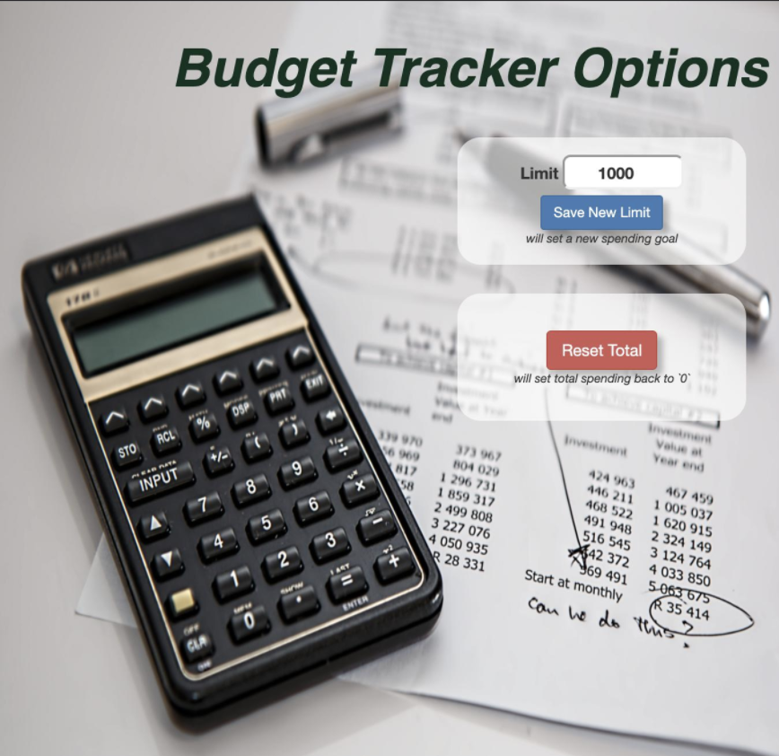

# Budget Tracker

## Project Description
A chrome extension to accept users' spendings, display current total spending tally, set a spending limit, and notify the user if that limit is reached; as well as an options page to reset the total and limit.
* Built by expanding upon [Codevolution Chrome Extension Tutorial](https://www.youtube.com/watch?v=8q1_NkDbfzE&list=PLC3y8-rFHvwg2-q6Kvw3Tl_4xhxtIaNlY&index=1)

## [Available in the Chrome Web Store](https://chrome.google.com/webstore/detail/kefbibfkinkpmcfdehfmdedogekjbpde/publish-accepted?authuser=0&hl=es)

## Set Up & Installation
-   Create directory with manifest.json and popup.html

## Dependencies
-   [jQuery](https://api.jquery.com/)
-   [Bootstrap](https://getbootstrap.com/)

## Future Goals
In my next edition of this project I would like to...
* perhaps add the functionality that users would be able to set different spending limits for different spending categories?

In truth I'm fairly content with leaving this project in its current state but would like to continue to follow the tutorial above in creating a new, and more involved Chrome Extension app.
